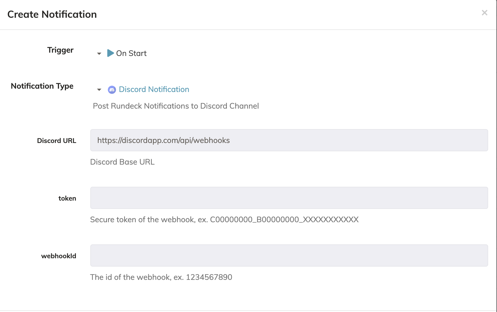

# rundeck-discord-webhook-plugin
======================================

> Disclaimer: This repo is under development and is NOT intended for a production environment.

Description 
-------------------------

Sends rundeck notification messages to a discord channel.  This plugin  is based on [rundeck-slack-plugin](https://github.com/bitplaces/rundeck-slack-plugin)

Installation Instructions
-------------------------

See the [Included Plugins | Rundeck Documentation](http://rundeck.org/docs/plugins-user-guide/installing.html#included-plugins "Included Plugins") for more information on installing rundeck plugins.

## Download jarfile

1. Download jarfile from [releases](https://github.com/rundeckpro/plugin-webhook-discord/releases/tag/v0.1.0)
2. copy jarfile to `$RDECK_BASE/libext`

## Build

1. build the source by gradle.
2. copy jarfile to `$RDECK_BASE/libext`

## Configuration
This plugin uses Discord incoming-webhooks. Create a new webhook and copy the provided url.

The only required configuration settings are:

- `Token`: the secure token of the webhook
- `Channel_ID`: the channel id this webhook is for, if any

## Contact

Provide a way for users to get in touch with you if they have questions or need help using your package. What information you give is up to you, but we encourage providing those below.

- Author: Craig Hobbs
- Email: chobbs@pagerduty.com
- Github: [@chobbs](https://github.com/chobbs)